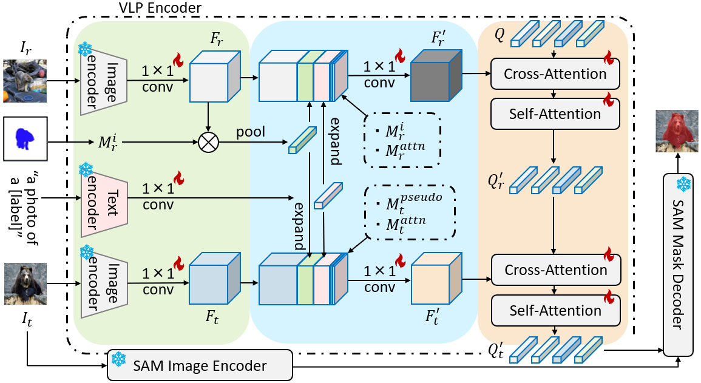
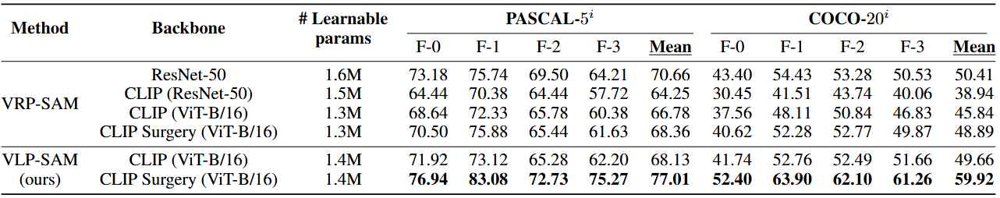

## VLP-SAM: Vision and Language reference Prompt into SAM

Official implementation of ['Vision and Language Reference Prompt into SAM for Few-shot Segmentation'](https://arxiv.org/pdf/2502.00719.pdf).

Authors: Kosuke Sakurai, Ryotaro Shimizu, Masayuki Goto.

<div align="center">
   <br>
</div>

## Requirements

- Python 3.11.5
- PyTorch 2.5.1
- Torchvision 0.20.1
- cuda 12.4.0

Environment settings (using Docker):
```bash
git clone https://github.com/kosukesakurai1/VLP-SAM.git
cd VLP-SAM

docker compose up -d
```

For training, use the following command to activate the virtual environment and run your scripts:
```bash
docker compose exec vlpsam /bin/bash
```


## Preparing Few-Shot Segmentation Datasets and Pre-Trained Weights
Download following datasets:

> #### 1. PASCAL-5<sup>i</sup>
> Download PASCAL VOC2012 devkit (train/val data):
> ```bash
> wget http://host.robots.ox.ac.uk/pascal/VOC/voc2012/VOCtrainval_11-May-2012.tar
> ```
> Download PASCAL VOC2012 SDS extended mask annotations from [[Google Drive](https://drive.google.com/file/d/10zxG2VExoEZUeyQl_uXga2OWHjGeZaf2/view?usp=sharing)].

> #### 2. COCO-20<sup>i</sup>
> Download COCO2014 train/val images and annotations: 
> ```bash
> wget http://images.cocodataset.org/zips/train2014.zip
> wget http://images.cocodataset.org/zips/val2014.zip
> wget http://images.cocodataset.org/annotations/annotations_trainval2014.zip
> ```
> Download COCO2014 train/val annotations from Google Drive: [[train2014.zip](https://drive.google.com/file/d/1cwup51kcr4m7v9jO14ArpxKMA4O3-Uge/view?usp=sharing)], [[val2014.zip](https://drive.google.com/file/d/1PNw4U3T2MhzAEBWGGgceXvYU3cZ7mJL1/view?usp=sharing)].
> (and locate both train2014/ and val2014/ under annotations/ directory).


Create a directory '../dataset' for the above few-shot segmentation datasets and appropriately place each dataset to have following directory structure:

    ../                         # parent directory
    ├── ./                      # current (project) directory
    │   ├── common/             # (dir.) helper functions
    │   ├── data/               # (dir.) dataloaders and splits for each FSS dataset
    │   ├── logs/               # (dir.) logs of each experiment
    │   ├── model/              # (dir.) implementation of VLP-SAM 
    │   ├── segment-anything/   # (dir.) code for SAM
    │   ├── weights/            # (dir.) weights of pre-trained model and embeddings
    │   |   ├── SAM/
    |   |   └── CLIP/
    │   ├── train.py            # code for training VLP-SAM
    │   └── SAM2Pred.py         # code for prediction module
    │    
    └── Datasets_HSN/
        ├── VOC2012/            # PASCAL VOC2012 devkit
        │   ├── Annotations/
        │   ├── ImageSets/
        │   ├── ...
        │   └── SegmentationClassAug/
        └── COCO2014/           
            ├── annotations/
            │   ├── train2014/  # (dir.) training masks (from Google Drive) 
            │   ├── val2014/    # (dir.) validation masks (from Google Drive)
            │   └── ..some json files..
            ├── train2014/
            └── val2014/


Download following weights:

> #### 1. SAM weights
> Download the pre-trained weights of SAM from [here](https://dl.fbaipublicfiles.com/segment_anything/sam_vit_h_4b8939.pth).
> (and locate sam_vit_h_4b8939.pth under weights/SAM/ directory).


## Training
We provide a example training script "train.sh". Detailed training argumnets are as follows:

> ```bash
> torchrun --nproc_per_node=$GPUs$ train.py \
>          --datapath $PATH_TO_YOUR_DATA$ \
>          --logpath $PATH_TO_YOUR_LOG$ \
>          --weightpath $PATH_TO_YOUR_WEIGHT$ \
>          --benchmark {coco, pascal} \
>          --backbone {resnet50, RN50, ViT-B/16, ViT-L/14, CS-RN50, CS-ViT-B/16, CS-ViT-L/14} \
>          --fold {0, 1, 2, 3} \
>          --condition 'mask' \
>          --num_queirs 50 \
>          --epochs 50 \
>          --lr 1e-4 \
>          --bsz 2 \
>          --text {yes, no}
> ```


#### Results (1-shot):

<div align="center">
   <br>
</div>

## Citation
If you use this code for your research, please consider citing:
````BibTeX
@article{sakurai2025vision,
    title={Vision and Language Reference Prompt into SAM for Few-shot Segmentation},
    author={Sakurai, Kosuke and Shimizu, Ryotaro and Goto, Masayuki},
    journal={arXiv preprint arXiv:2502.00719},
    year={2025},
}
````


## Reference

- [https://github.com/syp2ysy/VRP-SAM](https://github.com/syp2ysy/VRP-SAM)